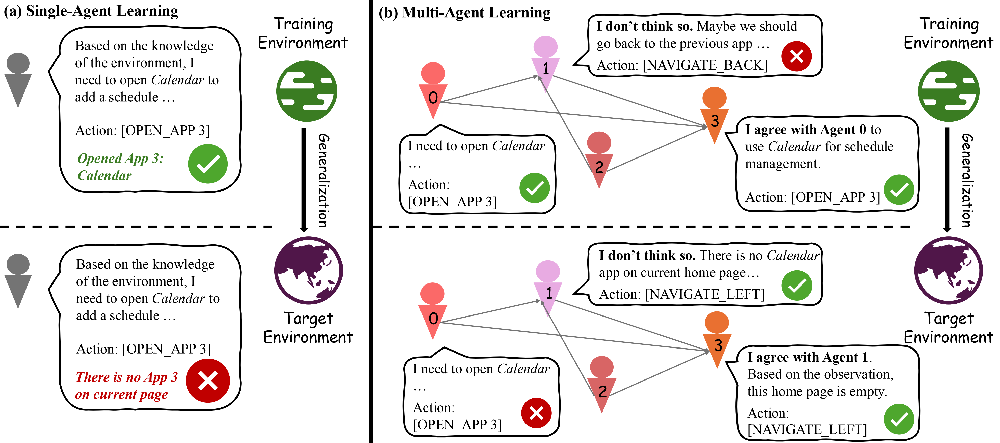
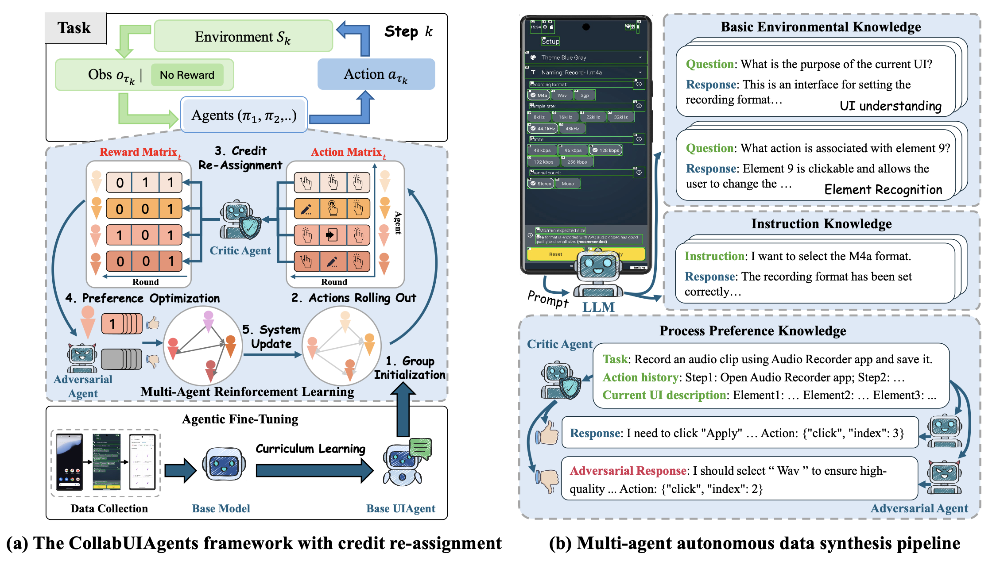

<h1> Advancing Language Multi-Agent Learning with Credit Re-Assignment for Interactive Environment Generalization</h1>

This is the official implementation of CollabUIAgents, a two-stage multi-agent learning framework for interactive environments.

# Overview



In single-agent learning, the agent could encounter obstacles when target environments are different from the training one, while in multi-agent learning, collaboration between agents might enable effective decision-making in both environments.



The challenge of achieving both strong performance and good generalization has hindered the progress of multi-agent systems for interactive environments. To address these issues, we propose CollabUIAgents, a multi-agent reinforcement learning framework with a novel multi-agent credit re-assignment (CR) strategy, assigning process rewards with LLMs rather than environment-specific rewards and learning with synthesized preference data, in order to foster generalizable, collaborative behaviors among the role-free agents' policies (as shonw in Figure (a)).  Empirical results show that our framework improves both performance and cross-environment generalizability of multi-agent systems. Moreover, our 7B-parameter system achieves results on par with or exceed strong closed-source models, and the LLM that guides the CR. We also provide insights in using granular CR rewards effectively for environment generalization, and accommodating trained LLMs in multi-agent systems.

# CollabUIAgents

The training data for agentic fine-tuning is synthesized automatically with a multi-agent data synthesis pipeline and consists of progressively complex instruction sets in three levels, designed to help agents build a strong foundation of environmental knowledge. The UI agent generates responses to synthesize queries faithfully, the adversarial agent generates negative samples, and the critic agent grades process rewards. As shown in Figure (b), given a task, the pipeline can autonomously collect data from each step covering basic environmental knowledge, simple instruction knowledge, and process preference knowledge in interactive environments. Our data collection pipeline is illustrated in Figure (b). The training dataset is publicly available at [ModelScope](https://modelscope.cn/datasets/ZhouHe/Agents_android_world_sample/summary), model training was implemented using [LLaMA-Factory](https://github.com/hiyouga/LLaMA-Factory).

# License

This repository is licensed under the [Apache-2.0 License](LICENSE). All open-sourced data is for resarch purpose only.

# Citation
If you find our work beneficial, please cite our work:

```
@article{he2025enhancing,
  title={Enhancing Language Multi-Agent Learning with Multi-Agent Credit Re-Assignment for Interactive Environment Generalization},
  author={He, Zhitao and Liu, Zijun and Li, Peng and Fung, May and Yan, Ming and Zhang, Ji and Huang, Fei and Liu, Yang},
  journal={arXiv preprint arXiv:2502.14496},
  year={2025}
}
```