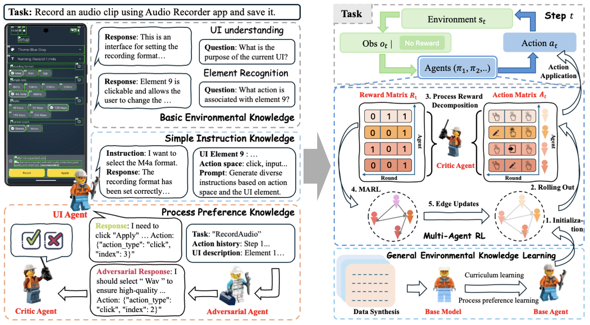

<h1>Enhancing Multi-Agent Learning in Real-World Interactive Environments through Process Reward Decomposition</h1>

This is the official implementation of CollabUIAgents, a two-stage multi-agent learning framework for interactive environments.

# Overview



The CollabUIAgents framework is designed to address the issues of sparse rewards and fixed roles in multi-agent learning. It operates without predefined roles, providing fine-grained rewards, and supports generalization across different environments. The framework is composed of two main stages: General Environmental Knowledge Learning and Multi-Agent Reinforcement Learning. In the first stage, the base model is adapted to the environment using curriculum learning on multi-level instruction data. In the second stage, a novel process reward decomposition strategy is introduced during reinforcement learning, allowing rewards to be distributed at both the agent and conversation round levels. This granular feedback fosters collaborative awareness among agents without predefined roles and improves learning efficacy. Experimental results show that our method significantly enhances the performance of multi-agent systems based on open-source models, achieving notable improvements both within and across domains, while also exhibiting strong cross-environment generalization capabilities. Moreover, our best-performing systems achieve results on par with or exceed those of the strong closed-source models, while maintaining the flexibility to be integrated with prompt-based multi-agent systems for future research.

# License

This repository is licensed under the [Apache-2.0 License](LICENSE). All open-sourced data is for resarch purpose only.

# Citation
If you find our work beneficial, please cite our work:

```
@article{liu2023dynamic,
  title={Dynamic llm-agent network: An llm-agent collaboration framework with agent team optimization},
  author={Liu, Zijun and Zhang, Yanzhe and Li, Peng and Liu, Yang and Yang, Diyi},
  journal={arXiv preprint arXiv:2310.02170},
  year={2023}
}
```